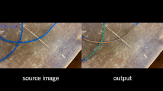

# Laboratory of Automation and Robotics (UNIBO) #

Greetings from Bologna, Italy! We are the laboratory of Automation and Robotics, where we and our students focus on the developments of robotics projects in several industrail scenarios.  

  

________________________________

## We are currently working on the project  [REMODEL](https://link-url-here.org)! ##

REMODEL is an european projects lead by the university of Bologna, His objective is the development technologies and solutions for the <b> <u>Robotic </u></b>  <b> <u>manipulation </u></b>  and <b> <u>perception </u></b>  of deformable linear objects (DLOs) like electrical wires, harnesses and medical hoose.

  
  

We are active with strategic partners in the following fields :
<ul>
  <li>Control Box Manufacturing and Tesing</li>
  <li>Automotive Harness Assembly</li>
  <li>Automotive Harness Manipulation</li>
  <li>Medical Equipment Manufacturing</li>
</ul>

